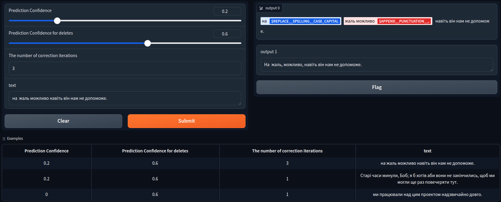

# General Information
Train und run the Seq2Tag model for the task of Grammatical Error Correction for the Ukrainian language.

## Installation
Currently, there is no PyPI package for this project, but I hope to add it soon!

First, please install [Poetry](https://python-poetry.org/). Then, in the root of the project run `poetry install`. This will install all the needed dependencies.

## Training
At the moment, there is no CLI command to train the model.<br>
However, you can do it directly from code:
```python
from ua_gec import Corpus
from gec.seq2tag import Seq2TagManager

# you can pass any custom list of documents compatible with the UA-GEC python package annotation
corpus = Corpus(partition="all", annotation_layer="gec-only")
seq2tag = Seq2TagManager(corpus=corpus, min_error_occurrence=3)
seq2tag.train()
seq2tag.push() # you will need to log in to your HuggingFace account first
```

## Accuracy & Performance
The model was trained only on the GEC part of the [UA-GEC dataset](https://github.com/grammarly/ua-gec).<br>
It reaches `63.46%` F0.5 score on the [UNLP 2023 Shared Task in Grammatical Error Correction for Ukrainian](https://github.com/osyvokon/unlp-2023-shared-task/tree/main). The model performs worse than those presented by other participants but it serves as a foundation for training larger models using synthetic data.

Since the model predicts the transformation tag for a token instead of rewriting it, the model is pretty fast. Correcting the UA-GEC test dataset (1509 documents) with 3 stages takes only `~82` seconds on a single GPU.

## Interface
We use Gradio to interact with the model. The interface expects a Seq2Tag model to explain predictions.

To start the web interface, please run `poetry run gradio interface.py`.


